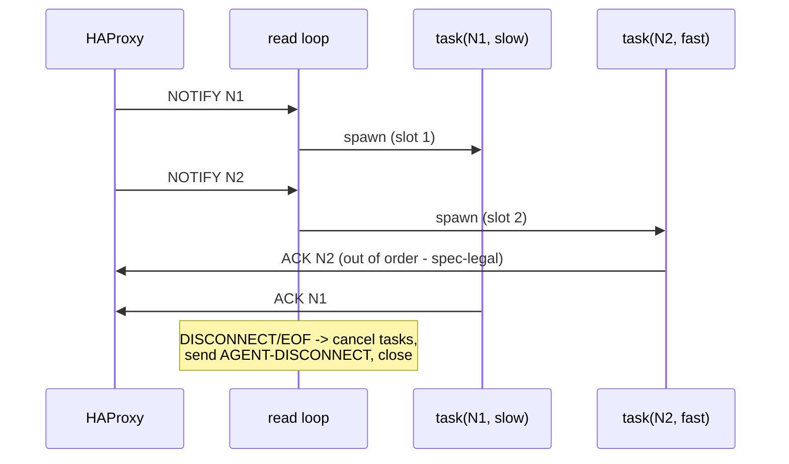

# Design: Concurrent Pipelining

Living design doc for honoring the negotiated `pipelining` capability with concurrent NOTIFY
processing. Drafted 2026-07-23 (claude), pending mjo ratification before any implementation.

## Problem

`ForgeHandler.core_handler` is strictly serial: read NOTIFY → run handler → send ACK → read next.
We advertise the `pipelining` capability, so HAProxy sends multiple NOTIFYs without waiting for
ACKs — but every frame on a connection queues behind the slowest handler. A 50ms handler caps the
whole connection at ~20 req/s regardless of how many streams HAProxy multiplexes onto it.

## Spec constraints (SPOE.txt, v3.2.0)

- `pipelining` is "the ability for a peer to decouple NOTIFY and ACK frames. This is a symmectical
  capability. To be used, it must be supported by HAProxy and agents. Unlike HTTP pipelining, the
  ACK frames can be send in any order, but always on the same TCP connection used for the
  corresponding NOTIFY frame." → **out-of-order ACKs are explicitly legal**; correlation is via
  the STREAM-ID/FRAME-ID echoed in each ACK (which we already do).
- `max-waiting-frames` (HAProxy's per-connection bound on frames awaiting ACK, historically
  default 20) is **deprecated and ignored** in current HAProxy → the agent cannot rely on the peer
  to bound in-flight frames. We must bound them ourselves.
- On HAPROXY-DISCONNECT, the agent must reply with its own DISCONNECT "as soon as possible".

## Prior art

- **criteo/haproxy-spoe-go**: read loop decodes frames and dispatches NOTIFYs to worker
  goroutines; a dedicated reply goroutine drains an `acks` channel and is the single writer.
- **negasus/haproxy-spoe-go**: same shape — per-frame worker, serialized writes.
- Both use *reader + concurrent workers + serialized ACK writes*; ordering is by completion, not
  arrival.

## Decisions

### CLOSED (pending ratification of this doc as a whole)

- **D1 — Concurrency is gated on the negotiated capability.** Concurrent dispatch only when
  `pipelining` was negotiated with this peer; otherwise the connection behaves serially. Driven
  directly by the spec's "symmetrical capability" wording.
- **D2 — One unified loop; serial = concurrency 1.** The read loop acquires a semaphore slot
  before decoding the next frame and spawns a task per NOTIFY; the task releases its slot after
  sending its ACK. With limit 1 this is byte-for-byte the current serial behavior, so there is
  one code path, not two (DRY; no serial/concurrent drift). Control frames (DISCONNECT,
  unexpected types) are handled inline in the read loop, never in tasks.
- **D3 — Bounded in-flight frames with TCP backpressure.** An `asyncio.Semaphore` bounds
  concurrent NOTIFYs per connection. At capacity the read loop simply stops reading, letting TCP
  flow control push back on HAProxy. Needed defensively since modern HAProxy no longer bounds
  waiting frames (see spec constraints).
- **D4 — Structured concurrency via `asyncio.TaskGroup`** (stdlib, Python 3.12 floor). Read loop
  and handler tasks live in one TaskGroup: any protocol-level exception in a task (e.g.
  `SpopFrameTooBigError` from an oversized ACK) cancels the group and tears down the connection
  with the same disconnect codes as today. `core_handler` switches to `except*` clauses to unwrap
  the ExceptionGroup; first matching error wins the disconnect message. Handler *user* exceptions
  never surface here — the registry already converts them to empty ACKs (hardening ticket 8).
- **D5 — Cancel in-flight tasks on disconnect/EOF.** When HAPROXY-DISCONNECT or EOF arrives,
  stop reading, cancel outstanding handler tasks, send AGENT-DISCONNECT, close. The spec wants the
  disconnect reply "as soon as possible", and HAProxy is abandoning those streams anyway —
  draining them would spend work nobody will read.
- **D6 — `max_concurrent_frames` lives on `ServerConfiguration`.** Amended in review (mjo,
  2026-07-24). Originally handler-level since it isn't negotiated, but `ServerConfiguration`
  already carries agent-configured, pre-negotiation inputs (`max_frame_size`), and the handler
  reads all other per-connection config from it — one config channel beats two.
- **D7 — ACK-send failure inside a task logs and ends the task** (as `send_frame` does today when
  the stream is closing); the read loop discovers the dead connection via EOF/reset. No separate
  signaling channel.

### Resolved from OPEN

- **O1 — ACK write path: direct-from-task.** (mjo, 2026-07-24) Tasks write their own ACKs. In
  asyncio each frame is fully encoded and written with a single `writer.write()` call, which
  synchronously appends the complete buffer to the transport — interleaving is impossible and
  concurrent `drain()` is safe. The Go libs' single-writer queue exists only because Go requires
  serialized `conn.Write`; it buys nothing here. Atomicity invariant documented at the write site.
- **O2 — Default `max_concurrent_frames` = 100.** (mjo, 2026-07-24) An in-flight frame costs one
  small task plus <= max_frame_size (4 KiB default) of payload (~400 KiB ceiling), and 20 (the
  historical HAProxy default) would silently throttle tuned deployments.

## Flow

## Concrete shape

- `server/constants.py`: `DEFAULT_MAX_CONCURRENT_FRAMES = 100`
- `ServerConfiguration(max_frame_size, max_concurrent_frames)`; handler reads
  `config.max_concurrent_frames`
- `core_handler`: handshake unchanged; then
  `limit = max_concurrent_frames if "pipelining" in config.capabilities else 1`;
  TaskGroup{ read loop: acquire sem → `Frame.decode` → control frames inline / NOTIFY → spawn
  `_process_notify(frame)` } where `_process_notify` = notify_handler → construct ACK →
  send → release.
- `SpoeForge(name, max_frame_size, debug, max_concurrent_frames)` → plumbed to `ForgeHandler`.
- `_find_common_capabilities`: comment updated — pipelining is now genuinely honored.

## Ticket plan

1. **[merged, PR #30]** `feat: concurrent NOTIFY dispatch gated on pipelining capability` — the unified TaskGroup
   loop in `ForgeHandler` with the semaphore at a constant default; `except*` mapping in
   `core_handler`. Tests: out-of-order ACKs (slow first handler, fast second), serial behavior
   when pipelining not negotiated, bound honored (N+1th frame waits), disconnect cancels
   in-flight tasks, protocol error in a task disconnects the connection.
2. **[merged, PR #31]** `feat: expose max_concurrent_frames on SpoeForge` — constructor plumbing,
   constants entry, README feature note, `_find_common_capabilities` comment fix.
3. **[in review]** `chore: validate pipelining end-to-end in docker harness` — slow-handler variant
   in `docker/sample_server.py`, concurrent-request validation against real HAProxy. Results below.

## Validation results (2026-07-24, docker harness)

Setup: async slow-path handler (0.5s when user-agent contains "slow"), harness backend switched to
`mode spop` (the modern engine; `mode tcp` is the legacy shape), agent debug logging on.

- **No head-of-line blocking end-to-end**: with a slow request in flight, a concurrent fast
  request completed in ~6ms vs the slow one's ~514ms, against both HAProxy 3.3 and 2.8. Under the
  old serial agent this was impossible on a shared connection.
- **Capability negotiation and connection reuse verified**: pipelining negotiated on every
  handshake; warm connections are reused with incrementing stream ids (NOTIFYs with stream_id=3
  observed on reused connections).
- **How HAProxy actually exercises pipelining**: both engines prefer opening/reusing
  *connections* over stacking concurrent frames onto a busy one. HAProxy 3.3's SPOP mux supports
  20 streams/connection when the agent advertises pipelining (`mux_spop.c`: `streams_limit = 20`
  gated on `SPOE_FL_PIPELINING`) but only returns connections to the shared avail list on stream
  detach, so independent client sessions land on separate connections. HAProxy 2.8's legacy
  applet engine behaves the same for independent sessions (capping `maxconn 1` queues rather than
  interleaves).
- **Conclusion**: agent-side concurrent pipelining is exercised deterministically by the unit
  tests (two NOTIFYs on one connection, ACKs asserted out of completion order) and stands ready
  for peers that stack frames — which the spec allows and HAProxy's mux is built for — while
  current HAProxy versions primarily spread concurrent load across connections. Either way the
  agent no longer serializes anything, and in-flight work is bounded per connection. No further
  agent-side changes indicated.

## Deferred

- Per-message concurrency limits or priority — no known need; revisit if a real workload asks.
- Draining (vs cancelling) in-flight work on graceful disconnect — only if a use case surfaces
  where late ACKs matter.
